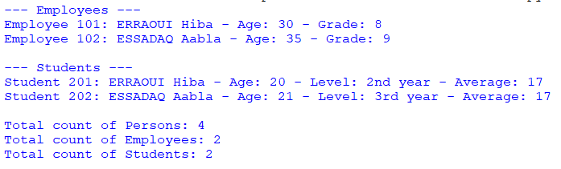

## Description
This program is a Python-based system designed for managing and organizing employee and student data. It utilizes classes such as 'Person,' 'Employee,' and 'Student' to create, store, and present detailed information about individuals in an organizational or educational context. This program offers functionalities for maintaining and displaying essential personnel records."
## Example

